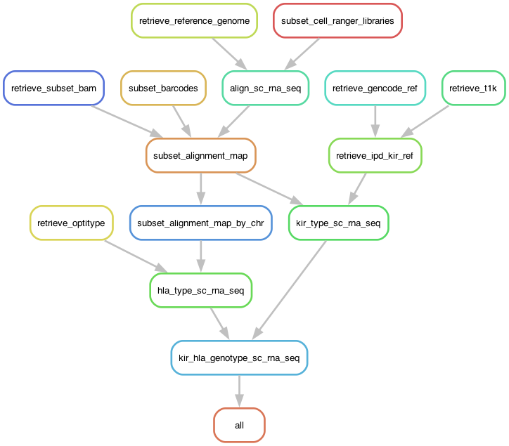

# KIR and HLA Typing for scRNA-Seq (TENX_2_KIR_HLA)
## _A Snakemake Pipeline to Run on the Imperial HPC (PBSPro)_

## Authors
* Christopher Michael Brooks ([@chrismbrooks](https://github.com/chrismbrooks))

# Workflow Overview



# Table of Contents
1. [Setup](#setup)
2. [Input](#inputs)
3. [Run](#run)
3. [Output](#output)

# Setup
To download and configure the pipeline, run the following command:

```sh
    git clone https://github.com/ChrisMBrooks/TENX_2_KIR_HLA.git
    cd TENX_2_KIR_HLA
```

Next, navigate to the [CellRanger Download Page](https://www.10xgenomics.com/support/software/cell-ranger/downloads#download-links) to obtain your API-KEY, SECRET and EXPIRATION from the Url Parameters. e.g.:

```
curl -o cellranger-8.0.0.tar.gz "https://cf.10xgenomics.com/releases/cell-exp/cellranger-8.0.0.tar.gz?Expires=1713236336&Key-Pair-Id=APKAI7S6A5RYOXBWRPDA&Signature=oMuXRsC81EYbR9mwSj93fhvbBuK~JHUAX26Q16ZHjcT4ZNILrWlafZIfs4xNnuDg7IyOc3p0c~5efnMSagLijkhVlO69J1FDG~~~AO5gbayLKFcaKOtVH9gL9EU5wwo6cFeBUvC5VAygST0VnoodyiiZMkV8VvUKObx8paYgS4McwSDk-lXJoawX~bqumcn29InNePxtERF4jlXdtMjtHh81C7HE6oGYZBv9rzwPM6y3ftPsdRfacjXlZPgxl3tHw-vrd~H6OvIR1B9vy2J1rOz9HilmvYLc52JYQlf5zAYH8nnFzOr7sTNjhFdMc60tdTF5dO~rHCABZsrWvUTxAA__"
```
Copy the URL parameters (``Expires``, ``Key-Pair-Id``, ``Signature``) into the ``example.pipeline.config.json`` file
```json
{
    "project":"TENX_TEST_PROJECT",
    "barcode_filename":"input/master_barcodes.csv",
    "reference_genome":"refdata-gex-GRCh38-2024-A",
    "cellranger_version":"cellranger-8.0.0",
    "10X_id":"APKAI7S6A5RYOXBWRPDA",
    "10X_key":"oMuXRsC81EYbR9mwSj93fhvbBuK~JHUAX26Q16ZHjcT4ZNILrWlafZIfs4xNnuDg7IyOc3p0c~5efnMSagLijkhVlO69J1FDG~~~AO5gbayLKFcaKOtVH9gL9EU5wwo6cFeBUvC5VAygST0VnoodyiiZMkV8VvUKObx8paYgS4McwSDk-lXJoawX~bqumcn29InNePxtERF4jlXdtMjtHh81C7HE6oGYZBv9rzwPM6y3ftPsdRfacjXlZPgxl3tHw-vrd~H6OvIR1B9vy2J1rOz9HilmvYLc52JYQlf5zAYH8nnFzOr7sTNjhFdMc60tdTF5dO~rHCABZsrWvUTxAA__",
    "10X_exp":"1713236336",
    "read_type":"single"
}
```

Then, rename the pipeline: 
```sh 
    mv "example.pipeline.config.json" "pipeline.config.json"
```
Next, run the following set-up commands:
```sh
    # Create a conda environment from which to run the pipeline
    conda env create -f snakemake_env.yml
    source activate snakemake_env
    
    # Run the snakemake setup pipeline 
    snakemake --snakefile setup.smk --use-conda --conda-frontend conda  --verbose --cores 8
    
    # Update the file permissions for the downloaded binaries
    chmod +x "software/cellranger-8.0.0/cellranger" \ 
        "software/subset-bam-1.1.0/subset-bam" \
        "software/t1k/run-t1k"
```

# Input
Three main input files must be configured before the pipeline can be run: 
* ``pipeline.config.json``
* ``input/master_barcodes.csv``
* ``input/master_library_definitions.csv``

One optional File
* ``--feature-ref`` (to be added)

## Pipeline Config JSON

The ``pipeline.config.json`` file is a simple high level JSON file containing configuration settings and metadata. The following key-item pairs are required: 

* ``project`` is an input string, and represents the project name to be used by snakemake, e.g. ``TENX_2_KIR_HLA_TEST``. 

* ``read_type`` is an input string, either ``single`` or ``double`` and is a flag to indicate the sequencing method (I believe 10X 3' is often single and 5' is paired.).

* ``barcode_filename``  is an input string, and is the path name to the barcode csv file discussed above, e.g. ``input/master_barcodes.csv``

* ``reference_genome``is the reference genome used throughout. It will be pulled form the 10X website, so the name must match exactly, e.g. ``refdata-gex-GRCh38-2024-A``.

* ``cellranger_version`` is the version of cellranger to be used. It will also be pulled from the 10X website, e.g. ``cellranger-8.0.0``.

* ``10X_id`` is an input string, and is the user 10x user id as discussed above. 

* ``10X_key`` is an input string, and is the user 10x API Key/ API secret as discussed above. 

* ``10X_exp`` is an input string, and is the expirary date assigned by 10x when a user visits the webpage.  

## Aggregated Barcodes CSV

The ``input/master_barcodes.csv`` file is an aggregated csv file containing all ``barcodes``, ``batch_ids`` and ``sample_ids``, e.g.: 

```csv
barcode,batch_id,sample_id
AAACCCAAGCCGATCC-1,1234GEX_1,1234GEX_1
AAACCCAAGGATACGC-1,1234GEX_1,1234GEX_1
AAACCCAAGTACAACA-1,1234GEX_1,1234GEX_1
```

## Aggregated Library Definitions

The ``master_library_definitions.csv`` is an aggregated csv file containing all library definitions, 1 per run/ batch, e.g.: 

```csv
fastqs,sample,library_type
/absolute/path/to/your/fastqs,GEX_BATCH_1,Gene Expression
/absolute/path/to/your/fastqs,GEX_BATCH_2,Gene Expression
```

* The ``fastqs`` csv column contains the full path (not relative) for the directory containing the relevant fastq files. Note that all fastqs, across multiple runs can be in the same directory.

* The ``sample`` csv column contains the prefix of the pertinent fastq files and must match the ``batch_id`` identifier outlined in the ``master_barcodes.csv`` file, e.g. the ``GEX_BATCH_1_5pGEX`` portion of ``GEX_BATCH_1_5pGEX_S1_L004_R1_001.fastq.gz`` and the ``GEX_BATCH_1_FB`` portion of ``GEX_BATCH_1_FB_S1_L004_R1_001.fastq.gz``

* The ``library_type`` csv column contains the type of scRNA-Seq run, be it ``Gene Expression``, ``Antibody Capture`` or ``Antigen Capture`` this is typically identified from the suffix of the fastq file, e.g.: 5pGEX_S1_L004_R1_001, FB_S1_L004_R1_001. 

The file should be prepared according to the definitions provided on the [10X Genomics Website](https://www.10xgenomics.com/support/software/cell-ranger/latest/analysis/running-pipelines/cr-feature-bc-analysis). 

 > NB1 - The ``sample`` must match the entry for ``batch_id`` in the ``master_library_definitions.csv``. 
 
 > NB2 - Although you can rename the prefix of a fastq file, Cell Ranger requires that the suffix of is left in tact, e.g. must end with ``S1_L004_R1_001.fastq.gz`` or equivalent.

# Run
```sh
qsub job_smk_tenx_2_kir_hla.pbs
```
 > NB - Resource requirements for individual snakemake rules can be adjusted in the ``cluster_config.yml`` file. 

# Output

Two output primary files are produced by the TENX_2_KIR_HLA pipeline, ``output/{project}/kir_genotyping_results.csv`` and ``output/{project}/kir_genotyping_results.csv`` each containing the pertinent genotyping results from T1K and Optitype, respectively, e.g.:

* ``output/{project}/kir_genotyping_results.csv``:

```csv
,kir_gene,allele_count,abundance,quality_score,batch_id,sample_id
0,KIR2DL1,2,358.387208,60,2292GEX_1,2292GEX_1
1,KIR2DL2,1,0.126356,0,2292GEX_1,2292GEX_1
2,KIR2DL3,2,22.92553,0,2292GEX_1,2292GEX_1
```

 > NB - The csv columns are defined in the original [T1K publication](https://doi.org/10.1101/gr.277585.122). 

* ``output/{project}/kir_genotyping_results.csv``:

```csv
,A1,A2,B1,B2,C1,C2,Reads,Objective,batch_id,sample_id
0,A*02:01,A*03:01,B*55:01,B*44:02,C*03:03,C*05:01,6013.0,5850.648999999994,2292GEX_2,2292GEX_2
1,A*02:01,A*03:01,B*55:01,B*44:02,C*03:03,C*05:01,5119.0,4980.786999999996,2292GEX_1,2292GEX_1
```

 > NB - The csv columns are defined in the original [Optitype publication](https://doi.org/10.1093/bioinformatics/btu548). 